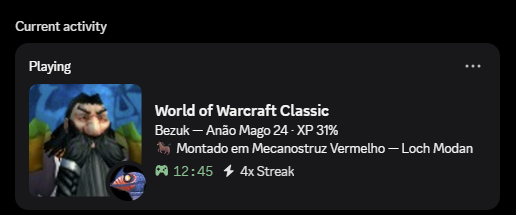
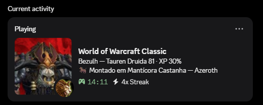

# Dwow

**🇺🇸 [English version](README.md)** · **Versão atual: v0.3.0**

> [!WARNING]
> **O Dwow ainda está em desenvolvimento ativo.** Funcionalidades, protocolo,
> configuração e estrutura do projeto podem mudar bastante com o tempo. Use a
> versão atual sabendo que atualizações futuras podem exigir novos ajustes.

> [!NOTE]
> **Compatibilidade com servidores não oficiais:** o Dwow provavelmente também
> funciona em servidores privados que utilizem um cliente e APIs de addon
> compatíveis. A principal limitação é o render 3D do personagem: personagens
> de servidores não oficiais não existem na Battle.net e, portanto, não podem
> ser encontrados pela API da Blizzard. Nesse caso, o Rich Presence continuará
> usando os retratos locais de raça e gênero como fallback. Não há garantia de
> compatibilidade com alterações próprias feitas por cada servidor.

Rich Presence para **World of Warcraft Classic** e **Project Ascension** que
mostra no seu perfil do Discord — em tempo real — o que o seu
personagem está fazendo: enfrentando um chefe, na fila de masmorra (com o
verdadeiro olho do LFG), voando na sua própria montaria, pescando, morto após
um wipe… mais de 45 estados distintos, em português ou inglês.

> [!IMPORTANT]
> **O Project Ascension possui suporte oficial a partir do Dwow v0.3.0.**
> Baixe o pacote `Dwow-Addon-Ascension` e selecione `"client": "ascension"`
> na configuração do companion. O suporte foi testado ao vivo no cliente
> Ascension 3.3.5, no realm **Warcraft Reborn**, usando o addon Dwow dentro do
> jogo. Os testes incluíram carregamento do addon, exportação por pixels,
> captura, pixels fracionários, estado do personagem, AFK e atualizações no
> Discord.
>
> **Situação dos assets:** as classes exclusivas do Ascension ainda não possuem
> assets próprios no Discord. Os dados dessas classes podem ser exportados, mas
> o Rich Presence poderá usar uma imagem genérica ou de fallback até esses
> assets serem adicionados.

## Clientes e pacotes suportados

O Dwow usa um único núcleo compartilhado do addon e do companion, com um
perfil pequeno para cada cliente. As releases geram pacotes separados:

| Cliente | Pacote do addon | Perfil |
|---|---|---|
| Classic Era / Hardcore / Season of Discovery | `Dwow-Addon-Classic-Era-*` | `classic_era` |
| Anniversary | `Dwow-Addon-Anniversary-*` | `anniversary` |
| Burning Crusade Classic | `Dwow-Addon-TBC-Classic-*` | `tbc_classic` |
| Mists of Pandaria Classic | `Dwow-Addon-MoP-Classic-*` | `mop_classic` |
| Project Ascension (3.3.5) | `Dwow-Addon-Ascension-*` | `ascension` |

O perfil Ascension inclui o manifest antigo, fallbacks para APIs 3.3.5, título
próprio da janela e leitura adaptativa de pixels fracionários. Como personagens
de servidores não oficiais não existem na Battle.net, são usados os retratos
locais de raça e gênero.
Os testes da v0.3.0 foram realizados no realm **Warcraft Reborn**, com o addon
Dwow instalado e funcionando dentro do Ascension. Outros realms e classes
personalizadas podem apresentar APIs, estados ou assets que ainda precisem de
suporte adicional.

## Exemplos

<p align="center">
  
  
</p>

Exemplos do Rich Presence mostrando personagens da **Aliança** e da **Horda**,
incluindo retrato, classe, nível, XP, montaria, localização e tempo de sessão.

## Limitações

- **O card do Discord não atualiza a cada segundo.** O addon coleta e exporta
  o estado do personagem uma vez por segundo, mas o companion respeita um
  intervalo mínimo de aproximadamente 15 segundos entre atualizações. O
  Discord também aplica seu próprio cache e atraso de propagação, então uma
  mudança pode demorar alguns segundos para aparecer no perfil.
- **O render 3D do personagem não é atualizado em tempo real.** A imagem vem
  da API da Battle.net, que normalmente atualiza o personagem somente depois
  que ele sai do jogo e os dados são sincronizados pela Blizzard. Equipamentos
  ou mudanças visuais recentes podem continuar mostrando o render anterior.
- **Estados rápidos podem não aparecer.** Uma atividade que começa e termina
  dentro da janela de atualização do Discord pode ser substituída pelo próximo
  estado antes de chegar ao card.
- **Não é possível forçar atualizações instantâneas pelo addon.** A limitação
  acontece fora do Lua: o addon transmite os pixels normalmente, enquanto o
  companion e o Discord controlam quando o Rich Presence é publicado e exibido.

```
┌────────────────────┐   pixels codificados    ┌──────────────────────┐
│  WoW Classic       │ ──── (na tela) ───────► │  Companion (Python)  │
│  + addon Dwow      │                         │  captura → decodifica│
│  (API oficial,     │                         │  → Rich Presence     │
│   zero injeção)    │                         └──────────┬───────────┘
└────────────────────┘                                    ▼
                                                      Discord
```

**Por que pixels?** Addons de WoW são sandboxed: não podem usar rede nem gravar
arquivos em tempo real. O addon desenha os dados como uma faixa minúscula de
células coloridas (3 px de altura) no canto superior esquerdo, e o companion lê
essa faixa capturando a janela — a mesma técnica do CraftPresence. Detalhes em
[docs/PROTOCOLO.md](docs/PROTOCOLO.md).

**Seguro:** o addon usa só a API oficial de addons; o companion apenas *lê* a
tela — não injeta nada no jogo, não lê memória e não envia input. Nunca
automatize input junto com este projeto: essa é a linha vermelha da Blizzard.

## Requisitos

- Windows 10/11, Discord desktop aberto
- Python 3.10+ com `pypresence` e `Pillow` (`pip install pypresence pillow`)
- WoW em modo **janela ou janela sem borda**, anti-aliasing (MSAA) desligado

## Instalação

### 1. Addon

Baixe o ZIP da sua versão do jogo em [GitHub Releases](https://github.com/bezumiya/Dwow/releases)
e extraia a pasta `Dwow` no diretório de AddOns. Se estiver instalando pelo
código-fonte, você também pode copiar `addon/Dwow` diretamente:

Copie `addon/Dwow` para a pasta AddOns do sabor que você joga:

```
World of Warcraft\_classic_era_\Interface\AddOns\Dwow   (Classic Era / Hardcore / SoD)
World of Warcraft\_classic_\Interface\AddOns\Dwow       (MoP Classic)
World of Warcraft\_anniversary_\Interface\AddOns\Dwow   (Anniversary)
```

No jogo, `/dwow` liga/desliga o export e `/dwow status` imprime o payload
atual (útil para diagnosticar).

### 2. Aplicação no Discord

1. Acesse <https://discord.com/developers/applications> → **New Application**.
   Dê o nome `World of Warcraft Classic` (é o que aparece como título do jogo).
2. Copie o **Application ID**.
3. (Opcional, para os retratos) Em **Rich Presence → Art Assets**, suba suas
   artes com as chaves `wow_classic`, `class_<classe>` e
   `race_<raça>_<male|female>`.

   As **38 imagens prontas para upload** estão em [`assets_discord`](assets_discord/README.md),
   junto com a lista de chaves e as instruções para configurar o portal.

### 3. Configuração do companion

```bash
cd companion
copy config.example.json config.json
```

Edite o `config.json`:

| Chave | Significado |
|---|---|
| `application_id` | o Application ID do seu app no Discord (obrigatório) |
| `client` | `classic_era`, `anniversary`, `tbc_classic`, `mop_classic` ou `ascension`; seleciona padrões seguros |
| `window_title` | substituição opcional do título de janela escolhido pelo perfil |
| `language` | `"pt"` ou `"en"` — idioma das frases do card |
| `use_race_image`, `show_realm`, `show_guild`, `show_xp`, `show_gold` | liga/desliga detalhes do card |
| `bnet.*` | opcional: render 3D do seu personagem via Battle.net API — crie um client grátis em <https://develop.battle.net>, preencha `client_id`/`client_secret`, ponha `enabled: true` e escolha `region` (`us`/`eu`) e `flavor` (`era`/`mop`/`anniversary`) |

> **Nunca commite o `config.json`** — ele guarda seus segredos e está no
> `.gitignore`.

### 4. Rodar

```bash
python main.py
```

Antes de executar normalmente, valide toda a instalação com:

```bash
python main.py --diagnose
```

O diagnóstico verifica configuração, captura do WoW, protocolo de pixels e
conexão com o Discord sem publicar um card de Rich Presence.

Com o WoW e o Discord abertos, seu perfil atualiza em ~15 s (limite do
Discord). O presence se limpa sozinho ~60 s depois de fechar o jogo.

**Auto-start (recomendado):** registre uma tarefa oculta de logon para o
companion ficar sempre esperando o jogo — rode uma vez no PowerShell:

```powershell
cd companion
.\install_autostart.ps1            # instala e inicia (invisível; log em companion.log)
.\install_autostart.ps1 -Remove    # desinstala
```

## Recursos

- **45+ estados** com ordem de prioridade: morte/wipe, chefes (com % de HP),
  bandeira/orbe de PvP, timers de afogamento e fadiga, voos de táxi por
  facção, profissões, casa de leilões, correio, vendedor/conserto, duelos,
  ressurreições, ociosidade…
- **Fila de masmorra/raid**: a textura verdadeira do olho do LFG aparece na
  miniatura enquanto você está na fila (LFD/RF no MoP, LFG Tool no
  Era/Anniversary, filas de BG em todos); o pop da fila toma o card por
  alguns segundos.
- **Sua montaria de verdade**: o nome na frase e o ícone dela na miniatura —
  o personagem fica sempre como imagem grande; estados ao vivo (voo, formas,
  morte…) aparecem como o ícone pequeno.
- **Formas de druida/xamã/priest/lock**: urso, gato, coruja lunar, viagem,
  voo, lobo fantasma, shadowform… cada uma com seu ícone, ao vivo.
- **Render 3D do personagem** (opcional, Battle.net API) como imagem do card,
  com retratos de raça como fallback.
- **Captura robusta**: janela certa do jogo, DPI awareness, relocação da
  faixa (addons de viewport), detecção de jogo travado, payload com checksum.

## Problemas comuns

| Sintoma | Solução |
|---|---|
| "Sem dados válidos" no log | personagem precisa estar no mundo; veja `/dwow status`; desligue MSAA; use modo janela/sem borda |
| Presence nunca atualiza | o Discord desktop precisa estar aberto antes do companion; confira o `application_id` |
| Render borrado/desatualizado | o render da Battle.net só atualiza no logout; personagem novo dá 404 por algumas horas (o retrato de raça cobre enquanto isso) |
| Olho da fila não aparece | `/reload` depois de atualizar o addon; fila LFD/RF só existe no MoP |

## Licença / avisos

Projeto pessoal, sem afiliação com a Blizzard Entertainment ou o Discord.
World of Warcraft e seus assets são © Blizzard Entertainment. O addon apenas
lê dados da API oficial e desenha pixels; sem garantias.

## Notas de versão

Consulte [CHANGELOG.pt-BR.md](CHANGELOG.pt-BR.md) para ver o histórico e as
instruções de atualização.
